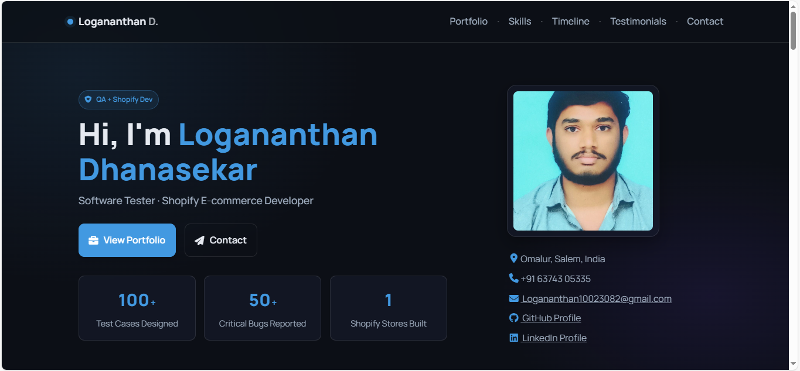

# Logananthan Dhanasekar | Software Tester Portfolio

Showcasing the projects, skills, and experience of Logananthan Dhanasekar in a modern, professional, and interactive web portfolio.

**[View the Live Demo](https://logananthan283.github.io/Portfolio/)**

## About

This website highlights my professional journey as a Software Tester and Shopify Developer. It is built from scratch with a clean, responsive "glassmorphism" design, advanced JavaScript features, and is structured for a professional user experience.

## Features

-   **Professional Glassmorphism UI:** Modern, subtle "glass" effect on all cards and the header for a professional aesthetic.
-   **Fully Responsive:** Adapts seamlessly to mobile, tablet, and desktop devices.
-   **Project Case Study Modals:** Portfolio items are clickable, opening a pop-up "modal" window with detailed project descriptions and links.
-   **Working Portfolio Filter:** Filter projects by category (All, QA, Shopify) with smooth fade-in/out animations (fixed with pure JavaScript).
-   **Active Nav Highlighting:** Navigation links automatically highlight the section you are currently viewing as you scroll (Scroll Spy).
-   **Dynamic Stat Counters:** Numbers in the "Stats" section animate (count up) when they scroll into view (fixed with pure JavaScript).
-   **CSS Tooltips:** Hover over skills, project cards, and links to see informative tooltips.
-   **Testimonials Section:** Includes real-world client feedback.
-   **Working Contact Form:** A functional contact form with client-side validation that submits to Formspree.
-   **Auto-Updating Copyright:** The footer year is set by JavaScript and is always current.

## Technologies

-   **HTML5:** For the core structure and content.
-   **CSS3:** For the glassmorphism design, tooltips, responsiveness, and all custom styling.
-   **JavaScript (ES6+):** Powers all interactive features, including the modal, filters, counters, scroll spy, and form validation.
-   **AOS (Animate on Scroll):** A lightweight library used for the "fade-up" animations on sections.
-   **Formspree:** Integrated for the contact form backend.

## File Structure

The project is split into three main files for clean, maintainable code:
-   `index.html`: The main HTML document.
-   `style.css`: All custom CSS styles.
-   `script.js`: All custom JavaScript functionality.

## Portfolio Sections

-   **Home:** Introduction and animated stats.
-   **About:** Professional summary.
-   **Skills:** A grid of technical skills with tooltips.
-   **Timeline:** Career and education history in a clean, vertical timeline.
-   **Portfolio:** A filterable grid of project cards that open case-study modals.
-   **Testimonials:** Client feedback.
-   **Resume:** A section with a direct download link for my PDF resume.
-   **Contact:** A fully functional contact form and social media links.

## Screenshot

**Note: Please update these screenshots with the new "glassmorphism" design!**

  

## Usage

Use this website to showcase your personal projects, skills, and experience to potential employers, collaborators, or clients. Update the project sections and contact info as needed.

## Contact

-   **Email:** logananthan10023082@gmail.com
-   **LinkedIn:** [Logananthan Dhanasekar](https://www.linkedin.com/in/logananthan-dhanasekar)
-   **GitHub:** [Logananthan283](https://github.com/Logananthan283)
